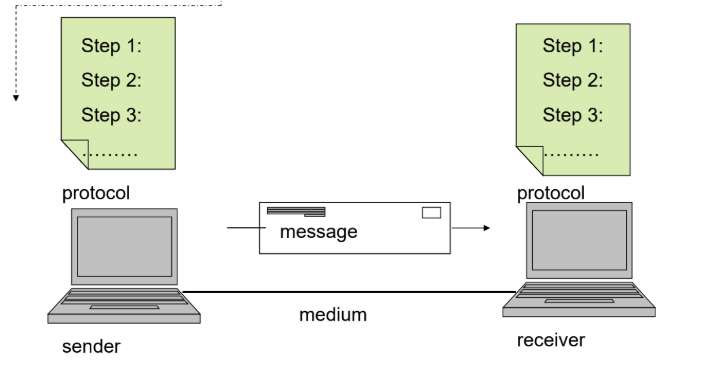
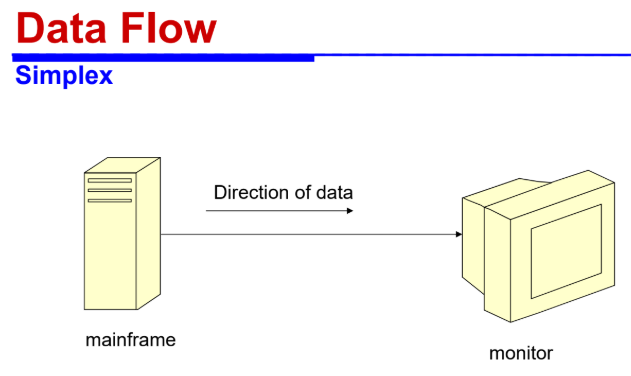
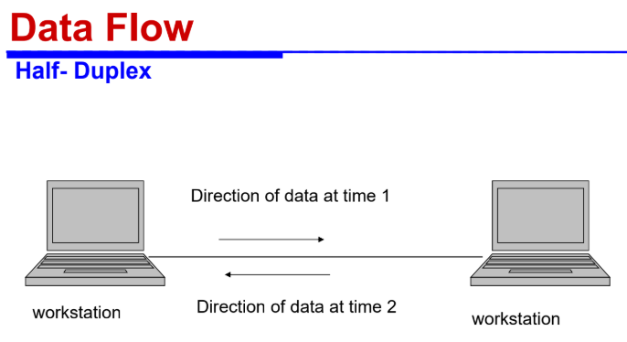
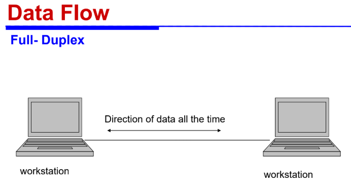
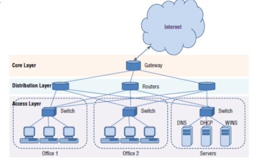
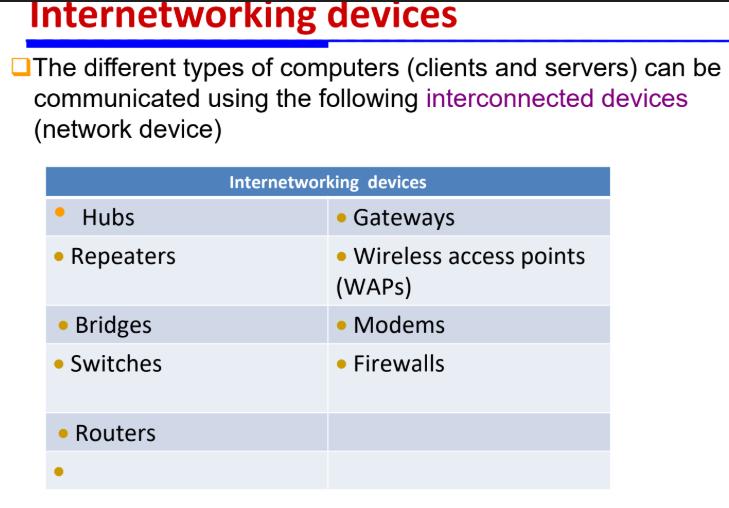
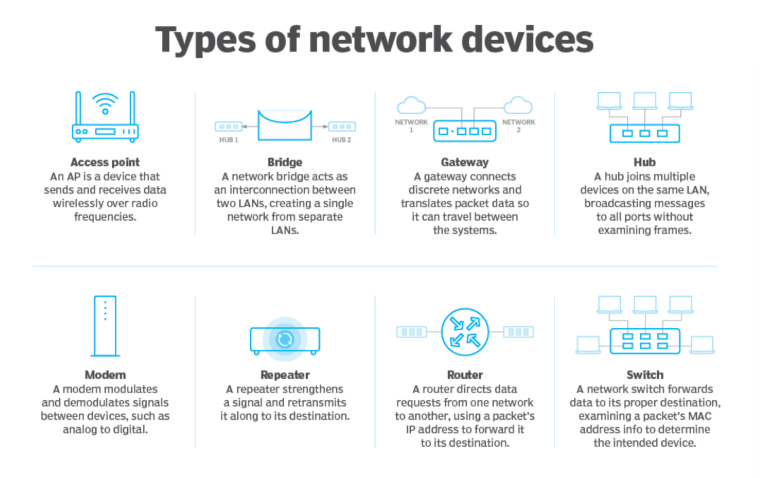

## Definitions
- Data Communication: transfer of data from one device to another via ==transmission medium(conducted, wireless)==.
- Network: collection of PCs, servers, mainframes connected to share data.
- Protocol: ==set of rules== defines ==how computer communicate==(address format, splitting data, etc) there're ==many different protocols for different aspects of network communication==.
- Data flow: transmission of data through(simplex, half-dup, full-dup) connections.
- Enterprise Network Arch: 3 layers(Core, Distribution, Access).
- more network components: DNS(translation IP address -> human understandable names) & DHCP(auto provide net config info for you).
- DHCP(dynamic host configuration protocol): provides(IP, Subnet mask, DNS server, Default gateway).

## Statements

- how do network communicate? medium
- medium:
	- wires & cables(conducted): twisted pair wire, coaxial cable, fiber optic cable.
	- Space(wireless): microwave trans, satellite, wifi, bluetooth
- required components to establish communication link? (sender, receiver, medium, message, protocol)

- Data flow: 
	- Simplex:
		one direction all the time, ex: keyboard->CPU, TV or Radio.
		
	- half-dup:
		one direction/time, not simultaneously, ex: walkie talkie.
		
	- full-dup:
		both direction all time, ex: phone
		

- Internetworking Devices:
	Core(back-bone): connect distro routers -> provide internet access(gateway router/default gateway) -has the proxy servers there-.
	Distribution: bridges gap between access&core, (routers: connecting all switches from access to core => mesh).
	Access: to end user devices(switches => star, tree).
	

	
	
	OSI Physical layer:
	1. Hub
	2. Repeater(not amplifying, copies & regenerate)
	OSI Data Link layer:
	==uses HW config MAC address==
	3. Bridge: 2 LANS, like repeater+MAC add read, 2port device
	4. Switch: intelligent, knows MAC add of ports, multi-port+buffer, has error checking
	5. WAP: used in WLAN radio signals, provide connection point between WLAN & wired Ethernet LAN
	OSI Network layer:
	6. Router: use headers&forwarding table, ==uses sw config network address==, dynamic update routing table.
	7. Firewall: HW/SW prevent un-auth access to private nets,located between 2 nets, uses VPN Firewall router encrypt data.
	
	
	- Gateways: translate data from one format to another, ex: SNA, sets between dev&mainframe-> translate req from both sides
	- Modem: modulate&demodulate signals digital(send) to analogue(receive)
	- VPN: establish protected network connection when using public net, encrypt ur traffic & mask/hide ur online id.