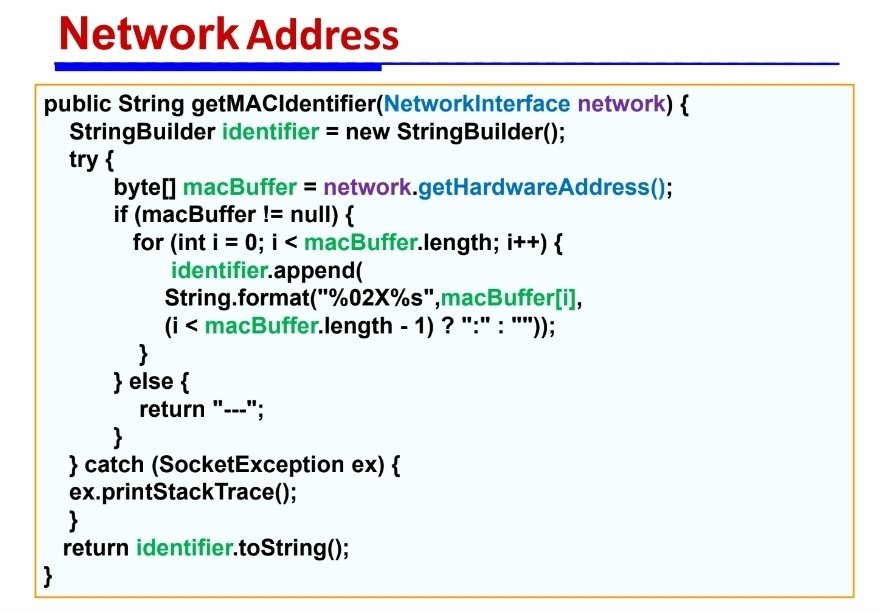
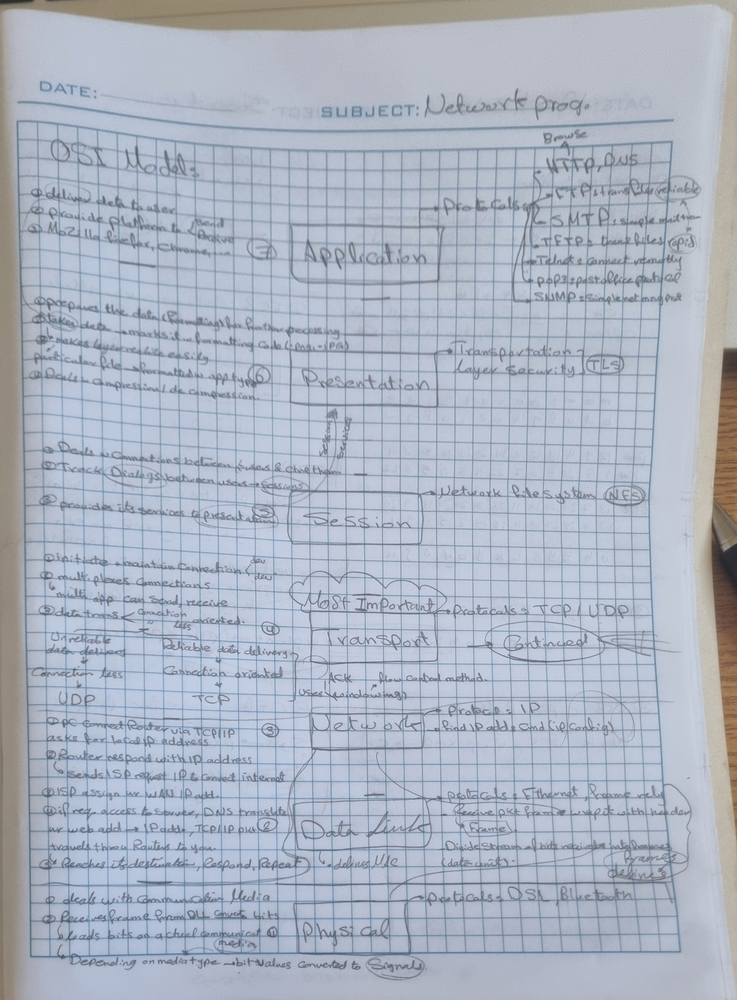

## Definitions

- Adresses: send info to appropriate node
- OSI: Open Systems Interconnection, 7layers, ==each support 1/more protocols==.
- Segmentation: trans-layer, breaking large data files into smaller ones that can be exchanged by network.
- UDP: connectionless, unreliable, isn't guaranteed to reach destination. (VOIP protocol).
- TCP: connection oriented, reliable -> gotta put extra labels on it to track where/when it is trans -> ACK when it's delivered (guaranteed delivery) + 3 ways handshake process. (HTTP, SMTP, FTP). 
- Windowing of flow control: window is defined between sender/receiver(how many frames of bytes can be trans/time).
- Connection Multiplexing: port number(1-65.5K) allows multiple apps to connect at a time, send/receive data.

## Statements

- Physical address = HW Adress, MAC address, NIC address, Ethernet Adress.
- ethernet NIC: Assigned unique number
- MAC: 48bits, groups of six pairs ==Hexa Decimal== seperated by dash|colon, ex: 08:00:27:b9:88:74
- MAC is ==HARD-CODED== in NIC by manfact, tho modern ones can be changed programatically.

### getting specific MAC adress:

returns string contains MAC for NetworkInterface
getHardwareAdress -> returns array of bytes holding the number, displayed as MAC adress.

### OSI model:

4. Transport Layer:
	1. Segmentation: in the transportation layer, divides the data ur pc needs into smaller chunks(smaller than ur pc's internet connection) deliver them one by one, reconstruct them again + msg informs completion of the process. 
	2. Connection Management & Reliable-Unreliable data delivery:: 
		![[media/6.png]]
		1. UDP: connectionless, unreliable, isn't guaranteed to reach destination. (VOIP protocol)
		2. TCP: connection oriented, reliable -> gotta put extra labels on it to track where/when it is trans -> ACK when it's delivered (guaranteed delivery) + 3 ways handshake process. (HTTP, SMTP, FTP). 
			1. ![[media/5.png]]
			2. following func to max reliability:
				- detect loss pkg
				- detect out-of-order pkt + reorder them
				- recognize dup pkt + drop extra
				- avoid congestion -> implementing control flow.
	3. Flow Control: ==Windowing==
		- implements Windowing of flow control: window is defined between sender/receiver(how many frames of bytes can be trans/time).
		- after sending segment, sender waits for ACK signal
		- if pkt lost -> receiver send ACK for pkt lost
		- sender resends lost pkt.

	4. Connection Multiplexing: port no.
		- allows multiple apps to connect at a time via port nums.
		- EX: server has many funcs, like FTP, DNS, etc -> if it has 1 IP add? won't perform all func for all hosts --> so, trans layer assign unique num/connection AKA ==Port number==.
		- ![[Pasted image 20251020113951.png]]
---
## Examples:
### Sending:
![[media/3.png]]

### Receiving:
![[media/2.png]]

### Overall Network Graph
![[media/1.png]]
