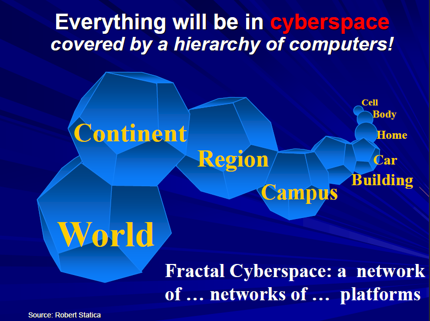
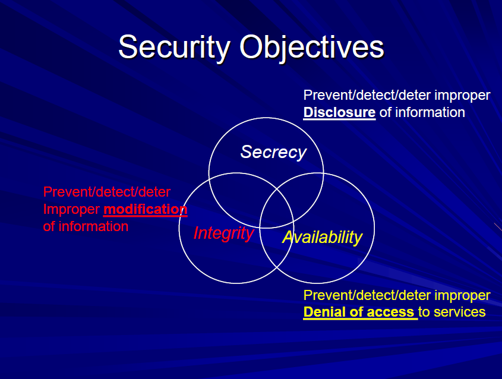

## Terminology and Foundational Concepts

* Computer Security: Refers to automated tools and mechanisms used to protect data within a computer, even if that computer is connected to a network
  * against hackers (intrusion)
  * against viruses
  * against Denial of Service attacks (DoS)
* (Inter)Network Security: Involves measures to prevent, detect, and correct security violations related to the transmission of information across a network or interconnected networks

## Definitions

* **Conceptual and Early Views of Cybersecurity:**

  * A foundational conceptualization posits that **Cybersecurity is** the Security of **Cyberspace**.
    * **Cyberspace** is viewed as a  **Fractal Cyberspace** **, encompassing a hierarchy of platforms, including networks of networks covering regions, campuses, buildings, cars, homes, and even the body**.
    * 
  * People define Cybersecurity: is the security of information systems and networks **(more common, but incomplete)**
    * the primary concern is not merely the security of the systems themselves, but rather the **operations and assets that depend on these information systems.**
* **The Comprehensive General View of Cybersecurity:**

  * **Cybersecurity = security of information systems and networks + with the goal of protecting operations and assets**
    * people often only consider security against attackers, but protection is also needed against  **accidents and failures**
  * **Cybersecurity = availability, integrity and secrecy of information systems and networks in the face of attacks, accidents and failures with the goal of protecting operations and assets**
* **Security Objectives:**

  

  * **Secrecy (Confidentiality):** The objective is to prevent, detect, or deter the improper **disclosure of information => This involves ensuring information is only accessible to authorized users.**
  * **Integrity:** The objective is to prevent, detect, or deter improper **modification of information =>** This means assets can only be modified by **authorized parties or in authorized ways**.
  * **Availability:** The objective is to prevent, detect, or deterimproper Denial of access to services => ****This ensures authorized users have access to information and associated assets when needed****.
* **Contextual Scope (Operations and Assets):**

  * **Corporate Cybersecurity:** Applies the goals (**availability, integrity, secrecy**) against attacks, accidents, and failures specifically to protect a **corporation's operations and assets**.
  * **National Cybersecurity:** Applies the same goals against the same threats to protect a **nation’s operationsand assets**
